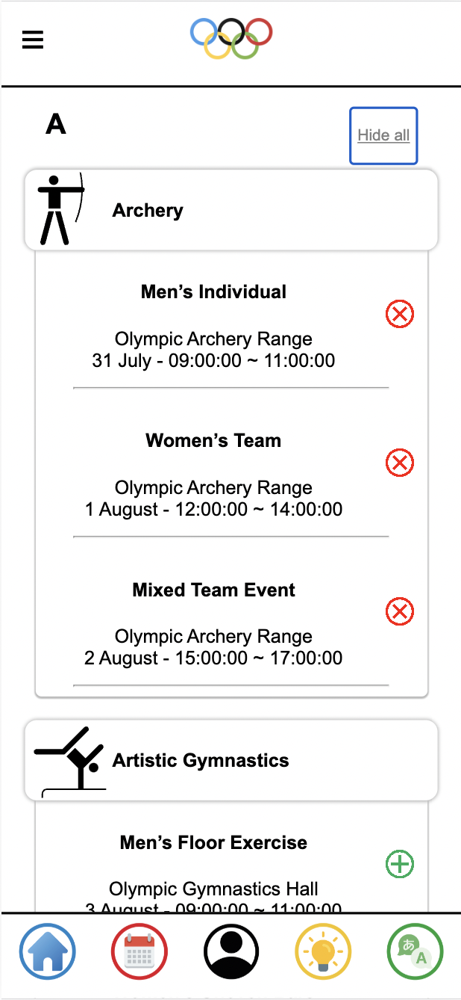

# Brisbane 2032 Olympics Event Planner

This mobile app aims to offer a planning tool and live guide for the culturally and linguistically diverse international visitors coming to the Brisbane 2032 Olympics. It emphasizes a culturally respectful event planning experience, utilizing speech translation and event recommendations connected to a prospective AI/ML model.

## Features

- **Event Planning**: Browse through all the Olympic events and plan a personal schedule around the ones you are interested in.
- **Speech Translation**: Real-time speech translation to help overcome language barriers.
- **Cultural Mindfulness**: The app is developed with “internationalisation” in mind from the get-go, ensuring a culturally sensitive user experience.

## Tech Stack

- **Frontend**: (React)
- **Backend**: ( Node.js, Express)
- **Database**: (SQL)
- On top of the **standard HTML/CSS** used for web development, **JavaScript** will be heavily used in our codebase to program all app interaction. In other words, JavaScript is really the main tool of choice here.

Backend features will also be coded in **JavaScript (running on the server à la Node.js)**, to allow our team to develop using a consistent language.

A relational **MySQL database** will be used to store app (event and user) data.

We will implement the translation functionality using APIs.

**UQcloud** will be used to host the app, backend and database.

## Getting Started

This app is designed to help international visitors plan their itinerary for the Brisbane 2032 Olympics. Here are the basic steps on how to get started with the app:

1. **Download and Install**:(Front-end and Back-end)
   git clone [[repository-url](https://github.com/developers3801/frontend.git)]
   git clone [[repository-url](https://github.com/developers3801/backend.git)]
   cd frontend
   npm install
   cd backend
   npm install
   npm start
   visit https://deco3801-developersx4.uqcloud.net/ to open the front end.

3. **Register and Login**: Create an account and log in.
   
   

   
4. **Browse Events**: Browse through the upcoming Olympic events and add the ones you are interested in to your personal schedule.

   

5. **Use Speech Translation**: Utilize the real-time speech translation feature to overcome language barriers.

   

## Dependencies
   JavaScript
   Node.js
   MySQL Database
   Translation APIs
   UQcloud 

## Appendix
QUESTIONS:
How to build software that combines language translation technology with cultural insights?
How to help visitors plan a culturally sensitive experience?

The Influence of an International Festival on Visitors’ Attitudes toward Diverse Cultures
Interacting with people from other countries can enhance our knowledge of cultural diversity and provide an international perspective. There are many ways of enhancing cultural understanding, one of which is attending international festivals. The findings suggest that international festivals play an important role in improving visitors’ awareness, appreciation, and acceptance of diverse cultures. Specifically, visitation frequency, the time spent at the event, and personal interest in cultures have significant influence on attitudes. These findings have implications for future researchers and event organisers.
 
However, conflicts may happen due to the misunderstanding of cultural differences.
 
The present findings suggested the scale has good reliability and validity and can be used success-fully to measure visitors’ attitudes toward diverse cultures in the festival setting. The item with the highest score was ‘Makes me more interested in trying different foods from other countries (Diversity of Contact)’
 
It indicated that people who have interest in cultures would pay more attention to cultural events and their attitudes toward diversity are likely more positive than those who do not have an interest in cultures.
 
The Influence of an International Festival on Visitors’ Attitudes toward Diverse Cultures
https://www.proquest.com/docview/2555481989?accountid=14723&pq-origsite=primo&forcedol=true
 
The impact of food culture on patronage intention of visitors: the mediating role of satisfaction
Foods play an important role in tourism development and marketing as they reflect the cultural identity of a place. Hence, on the whole, food festivals play a vital role in the state of tourist destinations because of the desirability they bring to the experience of a visitor altogether. Hence, tourism is promoted by the attractions' local cuisine and food heritage through the generation or reestablishment of cultural identity. 
Moreover, the tourism experience is developed by these two factors by linking tourists to specific attractions with local food, which, in turn, results in a genuine culinary tourism experience representing the particular culture of a region. Hence, supporting food experience is an essential factor that affects the level of tourists' satisfaction with revisiting a destination.
 
This reveals that in the context of Southeast Queensland, Australia, travellers' behavioural purposes play a vital role in their experiences concerning local food and tourism. Food is an essential part of the tourism industry that supports travellers' overall experience and can be a pinnacle tourism experience. Similarly, tourists may learn about local culture by tasting food prepared with local products and culinary skills.
 
Tasting local food in each region during travel is an integral part of the complete tourist experience. Food-loving tourists eat at least one or more meals in local restaurants to become more enjoyable for regular trips in each city's food culture.
 
The impact of food culture on patronage intention of visitors: the mediating role of satisfaction
https://www.emerald.com/insight/content/doi/10.1108/BFJ-12-2020-1165/full/html

Acknowledgments
Thanks to all who contributed to this project!

